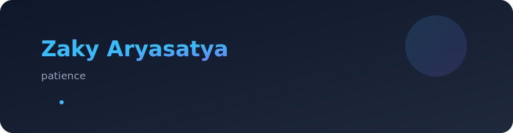

# Hi, I'm Zaky Aryasatya 👋

💭 *"Patience."*  
I believe growth takes time — and consistency builds greatness.

---

### 🧠 About Me
- 🎓 SMK RPL student passionate about **backend** & **network systems**
- 🚀 Currently exploring **Node.js**, **MongoDB**, and **DevOps**
- 🌌 Interested in **VSAT technology** and high-impact tech projects
- 💬 Always learning, always patient.

---

### ⚙️ Tech Stack

---

### 📊 GitHub Stats

---
🖤 *"Be patient. Empires aren’t built overnight."*
